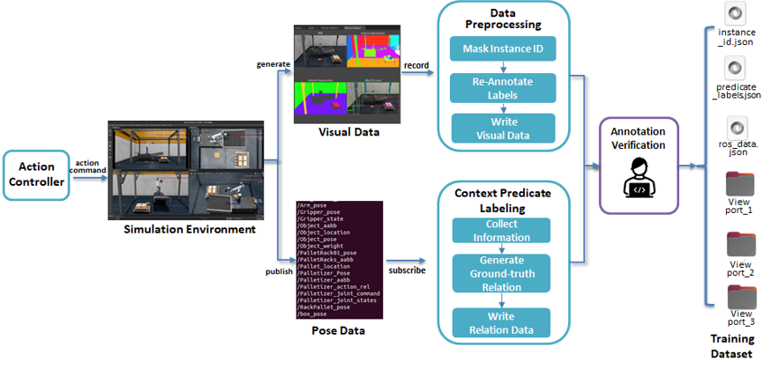

# Nvidia Isaac Sim을 활용한 로봇 제어 및 데이터 수집



---

## Description
- 이 프로젝트는 Nvidia Isaac Sim과 ROS를 연동하여 **AMR(Autonomous Mobile Robot)**과 Palletizer의 주행 및 작업 제어를 구현하는 것을 목표로 합니다.
- 작업 중 생성되는 데이터를 실시간으로 수집하며, 수집된 데이터는 머신러닝 모델의 학습 및 평가에 활용됩니다.

---

## Features

### 1) AMR과 Palletizer 로봇 협업 작업 구현
- Isaac Sim과 ROS 서비스를 활용하여 상자 적재 및 운반 작업 자동화
- Palletizer는 상자를 집어 팔렛에 적재하며, AMR 로봇은 적재된 팔렛을 목표 위치로 운반

### 2) 실시간 데이터 수집
- 로봇 및 환경 구성 물체의 상태를 ROS 토픽에서 수집
- 수집된 데이터는 JSON 파일 형태로 저장되어 이후 분석 및 학습에 활용

---

## ROS 기반 로봇 제어 프로세스


### 1) ROS Service Server
- **역할**: 로봇의 동작 요청을 처리하고, 콜백 함수로 제어 명령을 실행
- **주요 서비스**:
  - `/control_robot_move`: 로봇이 특정 노드로 이동
  - `/control_robot_lift`: 로봇이 팔렛을 들어 올리거나 내려놓음
  - `/control_robot_MoveBackwardToNode`: 로봇이 후진

### 2) ROS Service Client
- **역할**: 사전 정의된 시나리오(목표 노드와 행동)를 기반으로 서비스를 순차적으로 요청
- **주요 함수**:
  - `robotMove_Plan()`: 특정 경로를 따라 이동 명령 요청
  - `robotLift_Plan()`: 리프트 동작(Up/Down) 속도 제어 요청

### 3) ROS Publisher
- **역할**: 로봇의 속도 명령(`cmd_vel`) 및 조인트 값(`joint_command`)을 아이작 시뮬레이터로 전송

### 4) ROS Subscriber
- **역할**: 로봇의 위치 정보(`odometry_robot`)와 조인트 값(`joint_states`) 등을 수신

---

## 📂 Directory Structure

    ├── datasets/                        # 데이터 로더
    │   ├── GCMDataLoader.py             
    │   ├── raw/                         # 원본 데이터
    │   │   ├── Isaac/                   # Isaac 데이터셋
    │   │   └── MOS/                     # MOS 데이터셋
    ├── models/                          # 네트워크 모델 정의
    │   ├── CloudGCM_Network.py          
    │   ├── network_RelNet.py            
    │   ├── TripleNetGCN.py              # TripleNet GCN 모델
    │   ├── TT_GCN.py                    
    │   └── utils/                       
    │       ├── Graph_Vis.py             # 그래프 시각화 코드
    │       ├── visualization.py         # 시각화 유틸리티
    │       └── op_utils.py              
    ├── rule_based_contextManager/       # 규칙 기반 맥락 추론 모듈
    │   └── RuleContextManager.py        
    ├── data_collecter/                  # 데이터 수집 모듈
    │   └── DataCollecter.py             
    ├── GCM_main.py                      # 메인 실행 스크립트

---

## 4. Dependencies

### 설치 환경
```bash
conda create -n gcmAgent python=3.8
conda activate gcmAgent
pip install -r requirements.txt
pip install torch==1.12.1+cu113 torchvision==0.13.1+cu113 torchaudio==0.12.1 --extra-index-url https://download.pytorch.org/whl/cu113
pip install torch-scatter -f https://pytorch-geometric.com/whl/torch-1.12.1+cu113.html
```

---

## 5. 실행 방법 (Run Code)

### 1) 로봇 컨트롤러 서버 실행
```bash
roslaunch robot_controller robot_controller_demo.launch
```

### 2) 데이터 수집 실행
```bash
rosrun collect_data armlift_data_collector.py
```

### 3) 작업 시뮬레이션 실행
- Isaac Sim에서 **Perform Task** 버튼 클릭 후 작업 시작.

---

## 데모 ~

---